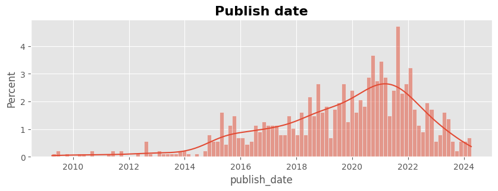
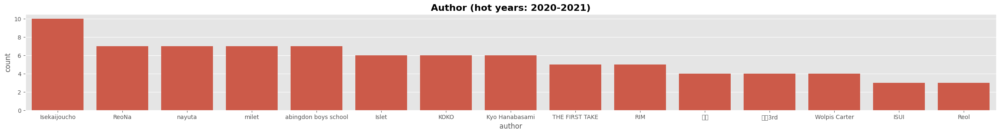
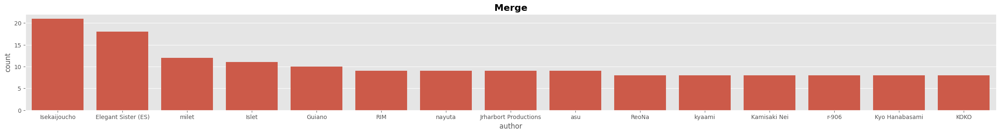

# youtube-playlist-extractor

# 1. Publish date

- 2020년, 2021년에 업로드된 영상들에 집중적으로 관심이 갔던 것 같다.

# 2. Author

- 전체 기간에 비해 해당 기간(2020년, 2021년)에 ReoNa, abingdon boys school, KOKO, Kyo Hanabashami 등이 랭크가 많이 올라왔다. Isekaijoucho도 해당 기간에 절반의 영상들이 업로드되었다.
- 이를 보면, 아마 버튜버들이 활발하게 활동했던 기간이라 많이 저장했던 것일지도 모른다.